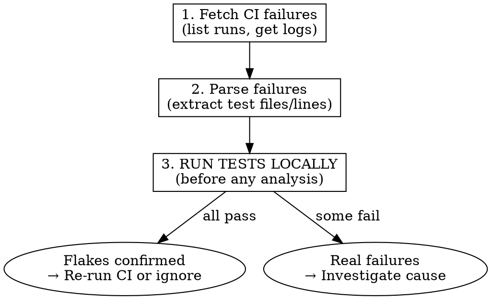

# CI Failures Skill

## Core Principle

Bridge "CI is red" to running failed tests locally. Fetch failures, parse test output, generate runnable commands.

## When to Use

- User mentions CI failure, red build, failed checks
- User wants to reproduce CI failures locally
- User asks what tests failed in a PR or branch
- User wants to add CI failures to local-ci checklist

## When NOT to Use

- User wants to predict which tests to run (use `local-ci` instead)
- CI passed and user is asking about something else
- No GitHub Actions in the repo

## Workflow



### 1. Fetch Failures (Quick)

```bash
# List recent failures for branch
gh run list -s failure --branch <branch> --json databaseId,displayTitle,createdAt --limit 5

# Get failed logs
gh run view <RUN_ID> --log-failed
```

### 2. Parse Test Failures (Quick)

Extract test file paths and line numbers - just enough to run locally:

```bash
# RSpec: find "rspec ./spec/..." lines
gh run view <ID> --log-failed | grep -E "^rspec ./spec/" | head -20

# Or find "Failed examples:" section
gh run view <ID> --log-failed | grep -A 50 "Failed examples:"
```

### 3. RUN TESTS LOCALLY FIRST

**Before analyzing error messages or investigating root cause, run the failing tests locally.**

```bash
# RSpec example
bundle exec rspec spec/path/to/file_spec.rb:123 spec/other_spec.rb:456
```

**If all tests pass locally → They're flakes.** Report this and suggest:
```bash
gh run rerun <ID> --failed
```

**If tests fail locally → Real failures.** Continue to detailed analysis below.

**Why local-first?** Many CI failures are flaky tests (race conditions, test pollution, timing issues). Running locally takes seconds and immediately tells you whether investigation is needed. Don't waste time analyzing error messages for tests that pass locally.

---

## Detailed Analysis (Only If Tests Fail Locally)

### 4. Validate Environment

```bash
gh auth status
gh repo view --json name -q '.name'
```

### 5. Fetch Full Logs

```bash
# Get failed job logs
gh run view <RUN_ID> --log-failed

# Get run metadata
gh run view <RUN_ID> --json jobs,conclusion,headBranch
```

### 5b. Fallback: Fetch Job Logs via API

If `--log-failed` returns empty (common when failure is in setup/load phase):

```bash
# Get failed job IDs
gh run view <RUN_ID> --json jobs | jq '.jobs[] | select(.conclusion == "failure") | {name, databaseId}'

# Fetch logs for specific job
gh api repos/<OWNER>/<REPO>/actions/jobs/<JOB_ID>/logs 2>&1 | tail -500
```

### 6. Detect Test Framework

Scan logs for framework markers:

| Log Pattern | Framework | Priority |
|-------------|-----------|----------|
| `rspec ./spec/`, `Failures:`, `.rb:` line refs | RSpec | HIGH |
| `FAIL src/`, `✕`, `jest` in path | Jest | HIGH |
| `FAIL `, `⎯⎯⎯ Failed Tests`, `vitest` | Vitest | HIGH |
| `FAILED test_*.py::`, `pytest` | pytest | MEDIUM |
| `--- FAIL: Test`, `_test.go:` | Go | MEDIUM |
| `Failure:`, `Error:`, `test/` paths | Minitest | MEDIUM |

**Load-time error patterns** (prevent tests from running at all):

| Log Pattern | Type | Priority |
|-------------|------|----------|
| `An error occurred while loading` | Load Error | CRITICAL |
| `error occurred outside of examples` | Load Error | CRITICAL |
| `NameError:`, `NoMethodError:`, `LoadError:` | Ruby Load Error | HIGH |
| `SyntaxError:` | Syntax Error | HIGH |

Load errors typically indicate:
- Missing require/include statements
- Undefined methods/constants used at class definition time
- Syntax errors

See `references/framework-patterns.md` for detailed parsing.

### 7. Parse Failures in Detail

Extract from logs:
- **File path** - Relative path to test file
- **Line number** - Where failure occurred (if available)
- **Test name** - Description or function name
- **Error message** - Brief failure reason

### 8. Generate Local Commands

Output format:

```markdown
## CI Failures from Run #<ID>

**Workflow:** <name> | **Branch:** <branch> | **Failed:** <date>

### <Framework> Failures (<count>)

| File | Line | Description |
|------|------|-------------|
| `path/to/test.rb` | 45 | test description |

**Run locally:**
```bash
<framework-specific command>
```
```

### 9. Optional: Add to local-ci

If `tmp/local-ci-checklist.md` exists and user requests:

```bash
# Check if checklist exists
test -f tmp/local-ci-checklist.md && echo "Checklist exists"
```

Add under `## Manual Additions (from CI)`:
```markdown
- [!] `spec/models/user_spec.rb:45` (FAILED - from CI run #12345678)
```

## Framework Command Reference

| Framework | Command Template |
|-----------|------------------|
| RSpec | `bundle exec rspec file:line file2:line2` |
| Jest | `yarn jest file --testNamePattern "test name"` |
| Vitest | `yarn vitest file -t "test name"` |
| pytest | `pytest file::TestClass::test_method -v` |
| Go | `go test -run TestName ./path/to/pkg` |
| Minitest | `ruby -Itest test/file.rb --name test_method` |

## Edge Cases

### No Failures Found
```markdown
No CI failures found in recent runs.

Last 3 passing runs:
- #123 (main) - 2h ago
- #122 (feature-x) - 5h ago
- #121 (main) - 1d ago
```

### Multiple Failed Runs
Default to most recent. Ask user if they want a specific run:
```
Found 3 failed runs. Showing most recent (#12345678).
Other failures: #12345677 (feature-y), #12345676 (main)
```

### Matrix Builds
Group by matrix dimension:
```markdown
### Ruby 3.2 / PostgreSQL 14
- `spec/models/user_spec.rb:45`

### Ruby 3.3 / PostgreSQL 15
- (all passed)
```

### Non-Test Job Failures
For jobs like `generate-api-docs`, `lint`, `build`, or `swagger`:
1. These often fail due to the same underlying code issue as test failures
2. Look for the same error patterns (NameError, syntax errors, missing dependencies)
3. The fix is usually in application code, not test code

Report separately:
```markdown
## Build/Lint Failures

**Job:** lint
```
error: unused variable `foo`
  --> src/lib.rs:42
```

These are not test failures. Fix the build errors first.
```

### Truncated Logs
```markdown
⚠️ Logs may be truncated. For full output:
```bash
gh run view <ID> --log > full-log.txt
```
```

## Grep Strategies for Large Logs

When logs are large, use these patterns to find errors quickly:

```bash
# Find Ruby errors
gh api repos/OWNER/REPO/actions/jobs/<ID>/logs 2>&1 | grep -E "(NameError|NoMethodError|LoadError|SyntaxError|error occurred)" | head -20

# Find the failing spec file
gh api repos/OWNER/REPO/actions/jobs/<ID>/logs 2>&1 | grep -E "loading.*spec/" | head -10

# Find RSpec failures section
gh api repos/OWNER/REPO/actions/jobs/<ID>/logs 2>&1 | grep -A 20 "Failures:"

# Find Jest/Vitest failures
gh api repos/OWNER/REPO/actions/jobs/<ID>/logs 2>&1 | grep -E "(FAIL|✕)" | head -20
```

## Quick Reference

```bash
# List recent failures
gh run list -s failure --limit 5

# View specific run's failed logs
gh run view <ID> --log-failed

# Get run as JSON
gh run view <ID> --json jobs,conclusion,headBranch

# Find which jobs failed
gh run view <ID> --json jobs | jq '.jobs[] | select(.conclusion == "failure")'

# Get logs for specific failed job (when --log-failed is empty)
gh api repos/OWNER/REPO/actions/jobs/JOB_ID/logs

# Re-run failed jobs
gh run rerun <ID> --failed
```

## Relationship to local-ci

| Skill | Purpose |
|-------|---------|
| `local-ci` | **Predict** tests to run based on changes |
| `ci-failures` | **React** to actual CI failures |

They complement each other:
1. Use `local-ci` before pushing to catch issues early
2. Use `ci-failures` when CI fails to quickly reproduce locally
3. Optionally feed CI failures into local-ci checklist for tracking
