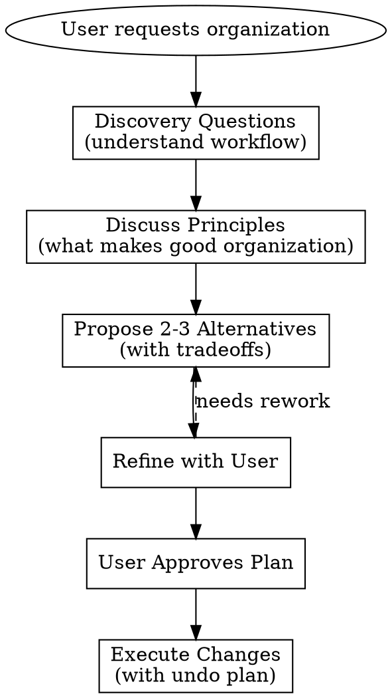

# Organizing Files and Directories

## Overview

File organization is deeply personal and workflow-dependent. **Never propose a structure until you understand how the user actually works with these files.** This skill guides a discovery conversation before any reorganization.

## Core Principle

```
UNDERSTAND WORKFLOW BEFORE PROPOSING STRUCTURE
```

The goal is not only to impose "best practices" but to discover an organization that matches how the user thinks about and accesses their files.

## The Process



## Discovery Questions (Ask ALL of These)

### 1. Usage Patterns
- "How do you typically find files in this folder - by name, date, type, or project?"
- "Which files do you access most frequently?"
- "Are there files here you haven't touched in months?"

### 2. Mental Model
- "If you were describing this folder's contents to someone, how would you group them?"
- "Are there natural categories you already think of these files in?"

### 3. Workflow Context
- "Do these files relate to a single project or multiple?"
- "Will you be adding more files like these over time?"
- "Do any tools or scripts expect files in specific locations?"

### 4. Constraints
- "Are there files that MUST stay where they are?"
- "Is this folder synced/backed up (Dropbox, git, etc.)?"
- "Do you share this folder with others?"

## Organizational Principles to Discuss

After discovery, share relevant principles and ask which resonate:

| Principle | Description | When It Applies |
|-----------|-------------|-----------------|
| **Minimize root clutter** | Few loose files at top level | Large folders, mixed content |
| **Group by purpose, not type** | "Client Work" not "PDFs" | Project-oriented workflows |
| **Group by type** | "Images", "Documents" | Media libraries, archives |
| **Temporal organization** | By year/month/week | Ongoing work, dated content |
| **Flat with naming conventions** | No subfolders, prefixed names | Small collections, quick access |
| **Combine small folders** | Merge folders with <3 files | Over-fragmented structures |
| **Archive vs Active** | Separate old from current | Long-lived folders |

**Ask:** "Which of these principles match how you think about your files?"

## Proposing Alternatives

**Always propose 2-3 different structures**, not just one. For each:

1. **Show the proposed structure** (tree format)
2. **Explain the organizing principle** used
3. **Highlight tradeoffs** (depth vs breadth, precision vs simplicity)
4. **Note what moves where** (major changes only)

Example format:
```
## Option A: By Project
Principle: Group files by what they're for
Tradeoff: Requires knowing which project a file belongs to

project-alpha/
├── docs/
├── images/
└── data/
project-beta/
└── ...
archive/

## Option B: By Type
Principle: Group files by what they are
Tradeoff: Files from same project scattered across folders

documents/
images/
data/
archive/
```

## Before Executing

**Required confirmations:**
- [ ] User has explicitly approved the chosen structure
- [ ] You've identified files that won't be moved (if any)
- [ ] You have an undo plan (list of moves to reverse)
- [ ] If git repo: confirm whether to use `git mv`

**Show the user:**
- Exact commands that will run (or summary if >10 moves)
- The "undo script" they could run to reverse changes

## Red Flags - STOP and Ask More Questions

- You're about to propose a structure based only on file extensions
- You haven't asked about access patterns
- User says "just organize it" without answering discovery questions
- You're creating more than 5 top-level folders
- Any folder would have only 1-2 files
- You're moving config files without asking about tool expectations

## Common Mistakes

| Mistake | Better Approach |
|---------|-----------------|
| Organizing by file type only | Ask how user thinks about files first |
| Creating deep hierarchies | Prefer 2 levels max unless user wants more |
| One file per folder | Combine related small groups |
| Moving without showing plan | Always show exact moves before executing |
| Ignoring existing partial organization | Build on what's already working |

## Anti-Patterns to Avoid

**Don't create folders like:**
- `Miscellaneous/` or `Other/` (catch-all = no organization)
- `Important/` (everything feels important)
- `Old/` without dates (when is old?)
- Nested folders more than 3 levels deep

**Don't:**
- Rush to action when user says "just do it"
- Assume your organization makes sense to them
- Create structure for hypothetical future files
- Over-engineer for a small number of files
